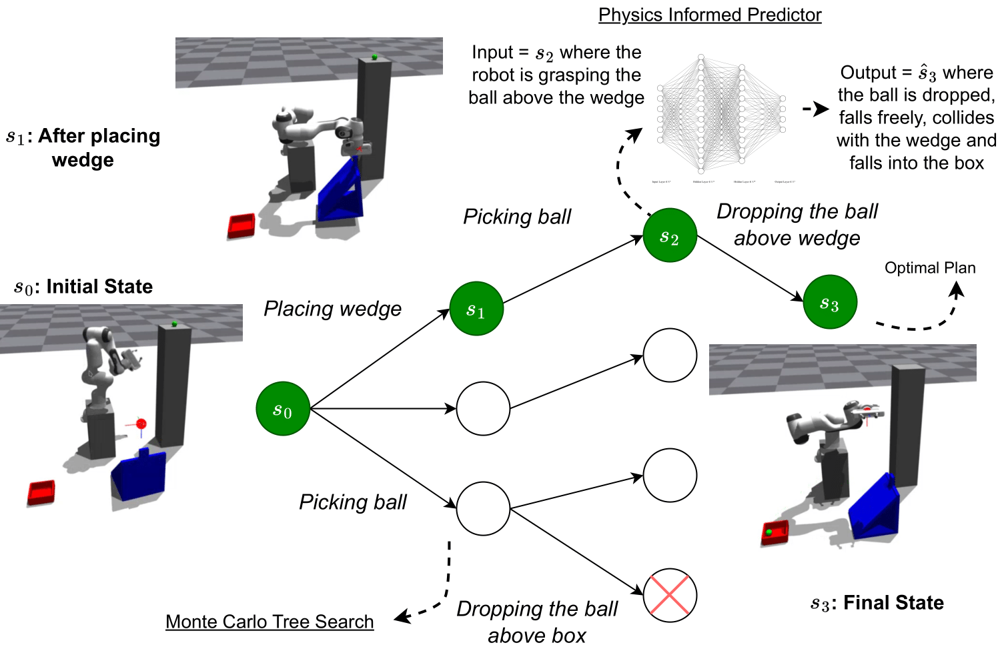

# PhyPlan
## Generalizable and Rapid Physical Task Planning with Physics-Informed Skill Networks for Robot Manipulators

### Please find here the [Website](https://phyplan.github.io/), and the [Paper]().



<div align='justify'>

#### We introduce a physics-informed planning framework to solve a set of challenging complex physical reasoning tasks.

> Given the task of positioning a ball-like object to a goal region beyond direct reach, humans can often throw, slide, or rebound objects against the wall to attain the goal. However, enabling robots to reason similarly is non-trivial. Existing methods for physical reasoning are data-hungry and struggle with complexity and uncertainty inherent in the real world. This paper presents PhyPlan, a novel physics-informed planning framework that combines physics-informed neural networks (PINNs) with modified Monte Carlo Tree Search (MCTS) to enable embodied agents to perform dynamic physical tasks. PhyPlan leverages PINNs to simulate and predict outcomes of actions in a fast and accurate manner and uses MCTS for planning. It dynamically determines whether to consult a PINN-based simulator (coarse but fast) or engage directly with the actual environment (fine but slow) to determine optimal policy. Evaluation with robots in simulated 3D environments demonstrates the ability of our approach to solve 3D-physical reasoning tasks involving the composition of dynamic skills. Quantitatively, PhyPlan excels in several aspects: (i) it achieves lower regret when learning novel tasks compared to state-of-the-art, (ii) it expedites skill learning and enhances the speed of physical reasoning, (iii) it demonstrates higher data efficiency compared to a physics un-informed approach. output a manipulation program that can be executed by the robot on the input scene resulting in the desired output scene.


## Installation

1. Follow the installation process for [Isaac Gym](https://developer.nvidia.com/isaac-gym) (version 1.0rc4). Further, ensure the specific versions of the following:

    | | Version |
    |---|:---:|
    | `cudatoolkit` | 11.1.1 |
    | `tkinter` | 8.6.12 |
    | `yaml` | 0.2.5 |

2. Create a virtual environment with Python=3.7.12 and install all the dependencies:

    ```bash
    conda create -n phyplan python==3.7.12
    pip install -r requirements.txt
    ```

3. Download and setup [GroundingDINO](https://github.com/IDEA-Research/GroundingDINO) (version 0.1.0) in Agent folder.

## Activating Environment
Execute commands in `activate_env.sh` in the terminal or run
```bash
source activate_env.sh
```

## Code Structure

<pre><code><b>PhyPlan</b>
├── <b>Agent:</b> (Baseline and Our Planner Implementation)
│   ├── <b>agent_models:</b> (Baseline models for each task)
│   ├── <b>assets:</b> (URDF files describing objects in the environments)
│   ├── <b>data:</b> (Training and testing data generated by data_generation.py)
│   ├── <b>data_generation.py:</b> (Generate traininig data for baselines)
│   ├── <b>detection.py:</b> (Detect objects from scene using GroundingDINO)
│   ├── <b>environments:</b> (Environment Descriptions for each task)
│   ├── <b>eval_agent.py:</b> (DQN-Adaptive Baseline)
│   ├── <b>experiments:</b> (experimental results)
│   ├── <b>GroundingDINO:</b> (Contains the downloaded GroundingDINO model)
│   ├── <b>phyre_eval_agent.py:</b> (DQN-Simple Baseline)
│   ├── <b>pinn_mcts_eval_agent_kernel.py:</b> (Our Planner with Kernel Regression (Under Progress))
│   ├── <b>pinn_mcts_eval_agent_kernel_widening.py:</b> (Our Planner with Kernel Regression and Progressive Widening (Under Progress))
│   ├── <b>pinn_mcts_eval_agent.py:</b> (Our Planner or reasoning agent)
│   ├── <b>pinn_mcts_eval_agent_widening.py:</b> (Our Planner with Progressive Widening (Under Progress))
│   ├── <b>pinn_models:</b> (PINN-based skill models)
│   ├── <b>plots:</b> (Plots generated by plot.py and heat_map.py)
│   ├── <b>random_eval_agent.py:</b> (Random Baseline)
│   └── <b>train.py:</b> (To train the baseline models)
│
└── <b>Skill_Learning:</b>
    ├── <b>Data_Collection:</b>  (Collecting dataset for different skills)
    │   ├── <b>Bouncing</b>
    │   ├── <b>Hitting</b>
    │   ├── <b>Sliding</b>
    │   ├── <b>Swinging</b>
    │   └── <b>Throwing</b>  
    └── <b>Skill_Network:</b> (Learning different skill)
        ├── <b>config.yaml</b>  
        ├── <b>main.py:</b>
        ├── <b>data.py:</b>
        ├── <b>model.py:</b>  
        └── <b>loss.py:</b>
</code></pre>


## Generating Training Data
Migrate to the Agent directory and run `python data_generation.py` with specific arguments to generate the data. Various arguments are:

| Argument | Description |
| --- | --- |
| env | Name of the environment to run |
| simulate (bool) | Set True to render the simulation |
| action_params | Dimension of action vector |
| L (int) | Number of contexts generated |
| M (int) | Number of actions per context |
| mode (train, test, dryrun) | Type of experiment running |
| fast (bool) | Invoke PINN for fast training |
| robot (bool) | Set True to use robot to perform actions |
| perception (bool) | Set True to use perception |

| Environment Name (internal) | Environment Name (external) | num_action_parameters |
| --- | --- | --- |
| `pendulum` | Launch | 2 |
| `sliding` | Slide | 2 |
| `wedge` | Bounce | 2 |
| `sliding_bridge` | Bridge | 3 |

<!-- Note: Use `data_generation_gpucb.py` to generate data with GP-UCB algorithm (as opposed to random sampling). -->

## Training Agent Models
Migrate to the Agent directory and run `python train.py` with specific arguments to train the models. Various arguments are:

| Argument | Description |
| --- | --- |
| env | Name of the environment to run |
| action_params | Dimension of action vector |
| epochs | Number of epochs to train each intermediate model |
| contexts | Total number of contexts to train |
| contexts_step | Number of training contexts after which to save intermediate model |
| fast | Train model on PINN data |

## Run Baselines

### DQN
Migrate to the Agent directory and run `python {phyre_}eval_agent.py` with specific arguments to get regret results. Various arguments are:

### LLM
Migrate to the Agent directory and run `python llm_brain.py` in one terminal and minimize it letting it run in the background. Now, in a new terminal again migrate to the Agent directory and run `python llm_eval_agent.py` with specific arguments to get regret results. Various arguments are:

| Argument | Description |
| --- | --- |
| env | Name of the environment to run |
| action_params | Dimension of action vector |
| simulate (bool) | Set True to render the simulation |
| model | Name of the agent model to evaluate |
| contexts | Total number of contexts to evaluate |
| actions | Number of actions available for each context |
| robot (bool) | Set True to use robot to perform actions |
| perception (bool) | Set True to use perception |

<!-- 
## Evaluating Action Results (Archived)
Migrate to the Agent directory and run `python {phyre_}eval_partial_agent.py` with specific arguments to get regret results. Various arguments are:

| Argument | Description |
| --- | --- |
| env | Name of the environment to run |
| action_params | Dimension of action vector |
| simulate (bool) | Set True to render the simulation |
| model | Name of the agent model to evaluate |
| contexts | Total number of contexts to evaluate |
| threshold | Performs actions until regret threshold is achieved | -->

## Run PhyPlan
This is the latest agent design which does not need any training or data generataion. It uses skill composition.

Migrate to the Agent directory and run `python pinn_mcts_eval_agent.py` with specific arguments to run MCTS algorithm. Various arguments are:

| Argument | Description |
| --- | --- |
| env | Name of the environment to run (Currently works only for `paddles`) |
| action_params | Dimension of action vector |
| simulate (bool) | Set True to render the simulation |
| contexts | Total number of contexts to evaluate |
| actions | Number of actions available for each context |
| robot (bool) | Set True to use robot to perform actions |
| perception (bool) | Set True to use perception |
| pinn_attempts (int) | Number of attempts using PINN before each simulator attempt |
| adaptive (bool) | Set False to not use GP-UCB adaptation |

## Experimentation Techniques
Migrate to the Agent directory and modify the scripts `data_generate.sh`, `train.sh`, `regret_exp.sh`, and `action_exp.sh` with the specific hyperparameters of the experiment. Stitch everything in `script.sh` and run it. Running all stages will take around 4-5 hours when robot is not employed.

**Note: Employing robot significantly slows down the simulation to avoid execution errors. Since, the robotic arm is not involved in reasoning, and only executes the actions to demostrate the physical feasibility and performability of our tasks, it is advised to train, analyse and compare the models without the robotic arm unless robotic visualisation is needed.**

 

### Skill Learning
Training different skills like sliding, swinging, throwing, hitting, bouncing. 


## Citation


</div>
